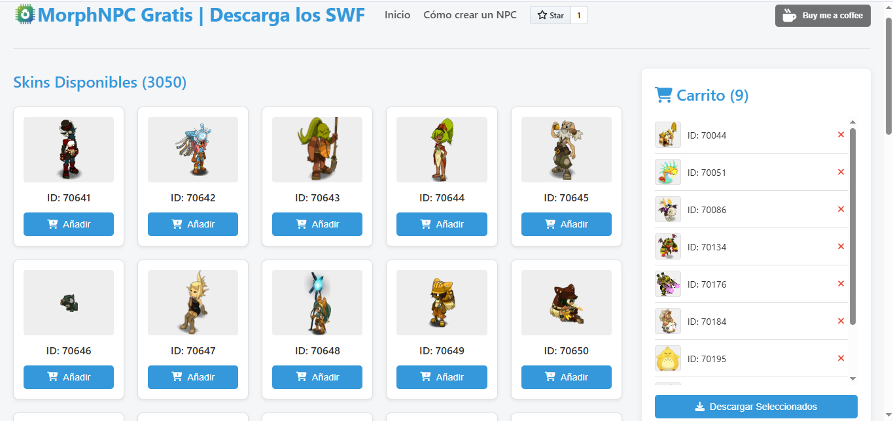

# MorphNPC | Descarga Gratis los SWF

**¡Bienvenido a MorphNPC ! Tu fuente definitiva para previsualizar y descargar Morph SWF para tus proyectos y servidores privados. Creado con ❤️ para la comunidad Latino-Francesa y para todos los entusiastas de la personalización.**

Pensado tanto para los recién llegados como para los veteranos en la creación de servidores, MorphNPC facilita la exploración visual de una vasta colección de SWF. Aquí podrás encontrar la inspiración que necesitas y descargar los assets para crear tus propios Packs de MorphNPC, llevando tu creatividad al máximo en tus mapas, eventos y aventuras.

---

## 🌟 ¿Qué es MorphNPC ?

MorphNPC Gratis es una plataforma web Open Source diseñada para:

*   **Visualizar fácilmente** una gran cantidad de skins (Morphs) en formato SWF a través de sus imágenes PNG correspondientes.
*   **Seleccionar y descargar** los SWF y PNG que necesitas para tus proyectos.
*   **Crear packs personalizados** de Morphs para una integración sencilla.
*   **Inspirar** a los creadores de contenido y administradores de servidores.

Nuestro objetivo es proporcionar una herramienta útil y accesible, fomentando la creatividad y el intercambio dentro de la comunidad.

## ✨ Características Principales

*   **Galería Extensa:** Navega por mas de 3000 MIL skins con previsualización instantánea.
*   **Paginación Intuitiva:** Explora la colección de forma ordenada y eficiente.
*   **Carrito de Selección:** Agrupa tus skins favoritos antes de descargarlos.
*   **Descarga en Lote:** Obtén todos los SWF y PNG seleccionados en un único archivo ZIP.
*   **Open Source:** ¡El código es tuyo! Contribuye, modifica y aprende.
*   **Interfaz Amigable:** Diseñada para ser fácil de usar por todos.
*   **Multi-idioma:** Soporte inicial para español y francés (Próximamente en francés).

## 🚀 Empezando

1.  **Visita la web:** [https://maestroyaco.github.io/MorphNPC/](https://maestroyaco.github.io/MorphNPC)
2.  **Explora la galería:** Utiliza la paginación para ver todos los skins disponibles.
3.  **Añade al carrito:** Haz clic en "Añadir" en los skins que te interesen.
4.  **Descarga tu pack:** Ve al carrito y haz clic en "Descargar Seleccionados". Recibirás un archivo ZIP con los archivos SWF y PNG.
5.  **¡Crea!** Utiliza los assets en tus proyectos. Consulta nuestra sección "Cómo crear un NPC" en la web para obtener guías básicas.

## 🛠️ Para Desarrolladores y Contribuidores

Este proyecto es Open Source y ¡tu ayuda es bienvenida!

*   **Repositorio GitHub:** [https://github.com/maestroyaco/MorphNPC](https://github.com/maestroyaco/MorphNPC)
*   **Tecnologías:** HTML, CSS, JavaScript (Vanilla JS).
*   **Hosting:** GitHub Pages.

Si deseas contribuir:
1.  Haz un Fork del repositorio.
2.  Crea una nueva Rama (`git checkout -b feature/nueva-funcionalidad`).
3.  Realiza tus cambios.
4.  Haz Commit de tus cambios (`git commit -m 'Añade nueva funcionalidad X'`).
5.  Haz Push a la Rama (`git push origin feature/nueva-funcionalidad`).
6.  Abre un Pull Request.

## 🌐 Únete a Nuestra Comunidad

¡Conéctate con otros creadores, comparte tus proyectos y obtén ayuda!

*   📜 **El Clásico Blog de MaestroYaco:** [maestro-yaco.blogspot.com](https://maestro-yaco.blogspot.com/) - Tutoriales, recursos y más.
*   💬 **Discord Latino-Francés:** [discord.com/invite/yZnADDUKHx](https://discord.com/invite/yZnADDUKHx) - Soporte, discusión y comunidad.

## ❤️ Apoya el Proyecto

Si MorphNPC Gratis te resulta útil, considera apoyar su desarrollo y el de futuras herramientas.

---
---

<!-- Versión en Francés -->

# MorphNPC | Téléchargez Gratuit les SWF

**Bienvenue sur MorphNPC ! Votre source ultime pour prévisualiser et télécharger des Morph SWF pour vos projets et serveurs privés. Créé avec ❤️ pour la communauté Latino-Française et pour tous les passionnés de personnalisation.**

Conçu aussi bien pour les nouveaux venus que pour les vétérans de la création de serveurs, MorphNPC facilite l'exploration visuelle d'une vaste collection de SWF. Ici, vous pourrez trouver l'inspiration dont vous avez besoin et télécharger les ressources pour créer vos propres Packs MorphNPC, poussant votre créativité au maximum dans vos cartes, événements et aventures.

---

## 🌟 Qu'est-ce que MorphNPC ?

MorphNPC Gratuit est une plateforme web Open Source conçue pour :

*   **Visualiser facilement** un grand nombre de skins (Morphs) au format SWF grâce à leurs images PNG correspondantes.
*   **Sélectionner et télécharger** les SWF et PNG dont vous avez besoin pour vos projets.
*   **Créer des packs personnalisés** de Morphs pour une intégration simple.
*   **Inspirer** les créateurs de contenu et les administrateurs de serveurs.

Notre objectif est de fournir un outil utile et accessible, encourageant la créativité et le partage au sein de la communauté.

## ✨ Fonctionnalités Principales

*   **Galerie Étendue :** Explorez plus de 3000 MIL skins avec aperçu instantané.
*   **Pagination Intuitive :** Explorez la collection de manière ordonnée et efficace.
*   **Panier de Sélection :** Regroupez vos skins favoris avant de les télécharger.
*   **Téléchargement par Lot :** Obtenez tous les SWF et PNG sélectionnés dans un unique fichier ZIP.
*   **Open Source :** Le code est à vous ! Contribuez, modifiez et apprenez.
*   **Interface Conviviale :** Conçue pour être facile à utiliser par tous.
*   **Multi-langue :** Support initial pour l'Espagnol et le Français (Prochainement en français).

## 🚀 Pour Commencer

1.  **Visitez le site web :** [https://maestroyaco.github.io/MorphNPC/](https://maestroyaco.github.io/MorphNPC)
2.  **Explorez la galerie :** Utilisez la pagination pour voir tous les skins disponibles.
3.  **Ajoutez au panier :** Cliquez sur "Ajouter" sur les skins qui vous intéressent.
4.  **Téléchargez votre pack :** Allez dans le panier et cliquez sur "Télécharger la Sélection". Vous recevrez un fichier ZIP avec les fichiers SWF et PNG.
5.  **Créez !** Utilisez les ressources dans vos projets. Consultez notre section "Comment créer un PNJ" sur le site web pour des guides de base.

## 🛠️ Pour les Développeurs et Contributeurs

Ce projet est Open Source et votre aide est la bienvenue !

*   **Dépôt GitHub :** [https://github.com/maestroyaco/MorphNPC](https://github.com/maestroyaco/MorphNPC)
*   **Technologies :** HTML, CSS, JavaScript (Vanilla JS).
*   **Hébergement :** GitHub Pages.

Si vous souhaitez contribuer :
1.  Faites un Fork du dépôt.
2.  Créez une nouvelle Branche (`git checkout -b feature/nouvelle-fonctionnalite`).
3.  Effectuez vos modifications.
4.  Faites un Commit de vos modifications (`git commit -m 'Ajoute nouvelle fonctionnalité X'`).
5.  Faites un Push vers la Branche (`git push origin feature/nouvelle-fonctionnalite`).
6.  Ouvrez une Pull Request.

## 🌐 Rejoignez Notre Communauté

Connectez-vous avec d'autres créateurs, partagez vos projets et obtenez de l'aide !

*   📜 **Le Blog Classique de MaestroYaco :** [maestro-yaco.blogspot.com](https://maestro-yaco.blogspot.com/) - Tutoriels, ressources et plus encore.
*   💬 **Discord Latino-Français :** [discord.com/invite/yZnADDUKHx](https://discord.com/invite/yZnADDUKHx) - Support, discussion et communauté.

## ❤️ Soutenez le Projet

Si MorphNPC Gratuit vous est utile, envisagez de soutenir son développement et celui de futurs outils.
